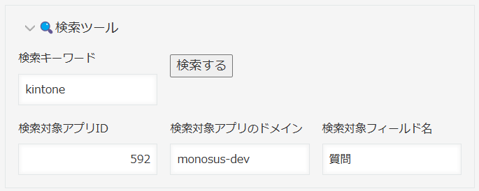
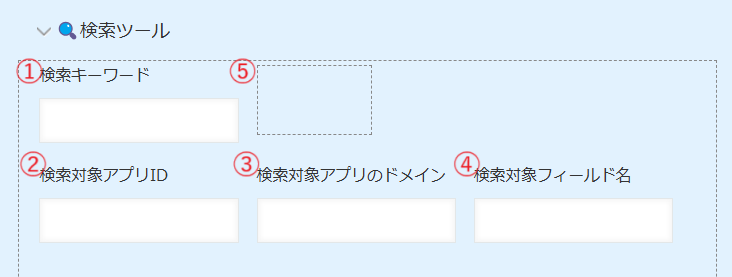
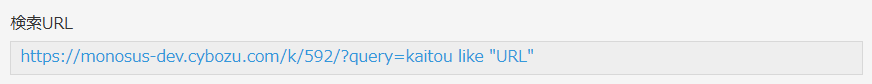
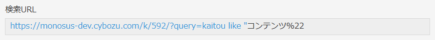
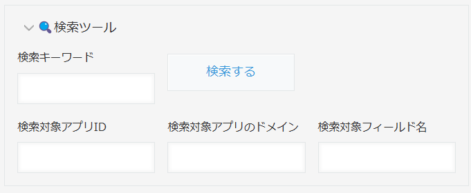

jump_like_it
====

このカスタマイズを追加すると指定したkintoneアプリのレコード検索を簡易的に実行します。
追加画面・編集画面にボタンを配置して、クリックすると新しく開いたタブにキーワードで絞り込んだ一覧を表示します。

## 概要
このカスタマイズは、kintoneのレコード編集画面に検索ボタンを追加します。この機能は、設定に従ってLikeで検索するクエリを追加したウィンドウを新しく開きます。

初期設定として、アプリに以下の5つのフィールドを配置してください。（グループフィールドはお好みで）

1. 検索キーワードを入力するフィールド
2. 検索対象アプリのアプリIDを記入するフィールド
3. 検索対象アプリのドメインを記入するフィールド
4. 検索対象アプリの検索対象フィールドコードを記入するフィールド
5. URLを開くボタンを配置するスペースフィールド

## インストール方法

kintoneアプリ単体に対して、『JavaScript / CSSでカスタマイズ』画面から追加してください。

### ファイルをアップロードして追加
- main.jsファイルをダウンロードして追加してください。
  - https://github.com/motohasystem/kintone_snippets/blob/v4/jump_like_it/main.js

### URL指定で追加
- jsdelivrから、任意のバージョンを指定して追加してください。
  - https://cdn.jsdelivr.net/gh/motohasystem/kintone_snippets@v4/jump_like_it/main.min.js

### 作成する5つのフィールドについて

このJSカスタマイズは、既定のフィールドコードを持った4つのフィールドの存在を前提としています。

テキストを取得できればよいので、一行文字列、数値、ラジオボタン、ドロップダウンが使えます。

1. 検索キーワードを入力するフィールド
    - フィールドコードを "snipet_query" とします

2. 検索対象アプリのアプリIDを記入するフィールド
    - フィールドコードを "snipet_appid" とします

3. 検索対象アプリのドメインを記入するフィールド
    - フィールドコードを "snipet_domain" とします

4. 検索対象アプリの検索対象フィールドコードを記入するフィールド
    - フィールドコードを "snipet_target_field" とします

5. URLを開くボタンを配置するスペースフィールド
    - フィールドコードを "button_search" とします

### ライトコースでの利用方法（JSファイルを使わない方法）

5つのフィールドを設定したうえで一行文字列に以下の計算式を設定すると、このJSカスタマイズと同等のURLを取得できます。

> "https://"& snipet_domain & ".cybozu.com/k/" & snipet_appid & "/?query=" & snipet_target_field & "%20like%20%22" & snipet_query & "%22"

良かったらお試しください。

なお、この場合は全角文字列がフィールドコードや検索キーワードに含まれるとリンクがうまく張られないようです。すべて半角を対象と限定するか、コピペしてご利用ください。

## 補足
- アプリにKUC（Kintone UI Component）が読み込まれている場合は、KUCを使用してボタンを作成します。KUCの利用については、アプリのカスタマイズ画面で、PC用のJavaScript / CSSファイルに以下のURLを追加してください。

  - https://unpkg.com/kintone-ui-component@1.0.0/umd/kuc.min.js

### 注意事項
- フィールドコードが正しく設定されていない場合、エラーメッセージが表示されます。フィールドコードを確認してください。

