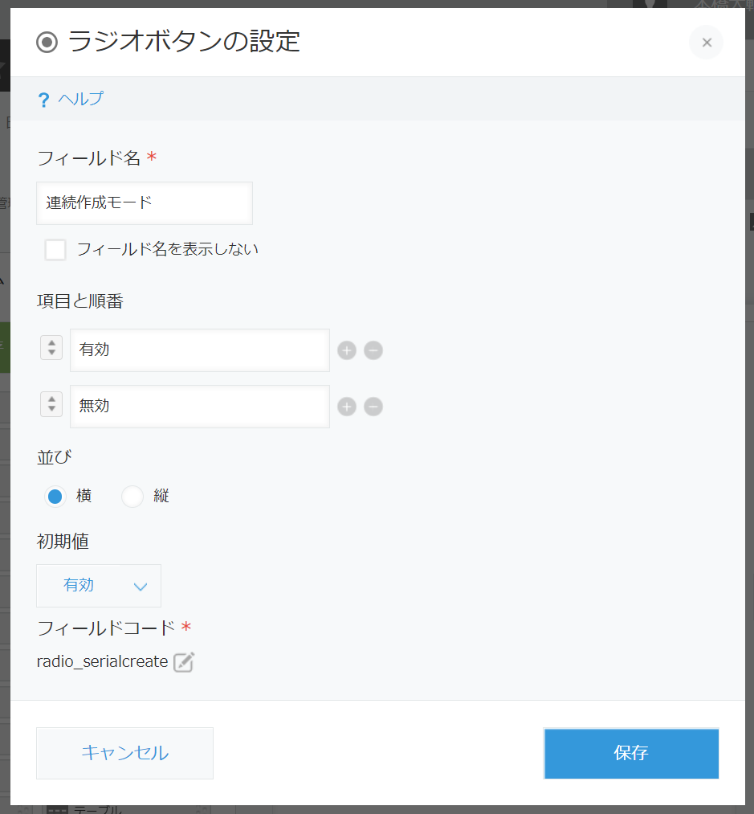

serial_create
====


## description
レコード追加を連続実行するためのJavaScriptカスタマイズです。
JSファイルの冒頭にある FIELDCODE_RADIO_SERIAL あたりの定数定義に従って、以下のフィールドを追加したアプリに適用してください。

```javascript
(function () {
    "use strict";
    const CONSTANTS = {
        FIELDCODE_RADIO_SERIAL: "radio_serialcreate",   // ラジオボタンのフィールドコード
        FIELDVALUE_SERIAL_ENABLED: "有効",              // ラジオボタンアイテムのラベル
    };
```

## install
#### フィールドの作成
- ラジオボタンを作成して、フィールドコード"radio_serialcreate"とする
- ラジオボタンの値として「有効」と「無効」を追加する

<div style="text-align: center;">
    
</div>

#### JavaScriptカスタマイズの登録
- JavaScriptカスタマイズとして、SweetAlertを以下のURLで登録する
    - https://unpkg.com/sweetalert/dist/sweetalert.min.js

- このカスタマイズをセットする
    - ダウンロードしたjsファイルを登録するか、または以下のjsdelivrのURLを指定してください。
        - https://cdn.jsdelivr.net/gh/motohasystem/kintone_snippets@v1/serial_create/serial_create.js

<div style="text-align: center;">
    
</div>
