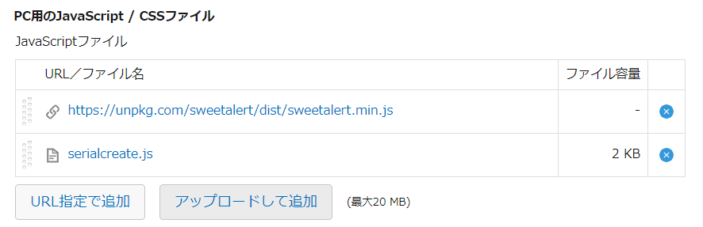

# description
レコード追加を連続実行するためのjavascriptカスタマイズです。
先頭にある FIELDCODE_RADIO_SERIAL あたりの定数定義に従って、以下のフィールドを追加したアプリに適用してください。

# install
- フィールドコード"radio_serialcreate"というラジオボタンを作成
- ラジオボタンの値として「有効」と「無効」を追加する
- SweetAlertを以下のURLで登録する
    - https://unpkg.com/sweetalert/dist/sweetalert.min.js

# jsdelivr
https://cdn.jsdelivr.net/gh/motohasystem/kintone_snippets@latest/serial_create/serial_create.js

